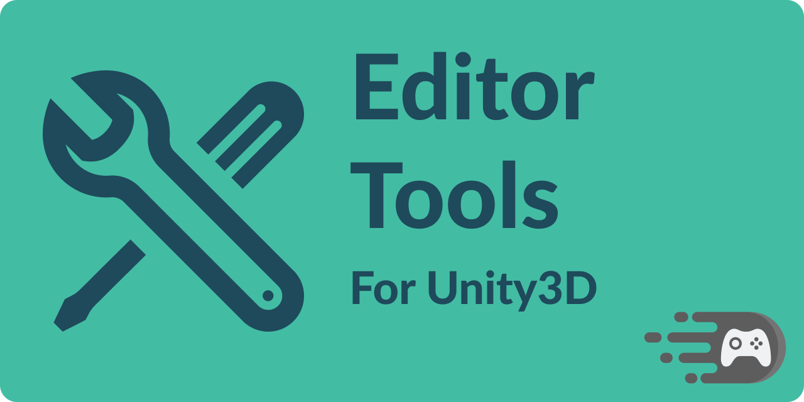

# editor-tools

Tools for improving the Unity Editor experience ✨🏗

This package contains some useful editor tools that I found myself needing in several projects. For more details, see [the getting started docs](https://editor-tools.faster-games.com//manual/getting-started).
